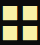

# 智能俄罗斯方块(Tetris Agent)

## 项目描述(Project Description)


本项目是运行于终端的俄罗斯方块游戏，并且在该游戏的基础上设计了一款俄罗斯方块游戏机器人，该机器人通过PSO(Particle Swarm Optimization)算法进行学习，最终得到平均180万分的成绩。

This is a Tetris game project which is running on the terminal. A game agent is designed on the basis of this game which learns by PSO (Particle Swarm Optimization) algorithm and finally gets an average score of 1.8 million points.

### Ennvironmental Requirement

```
gcc version == x86_64-8.1.0-release-posix-seh-rt_v6-rev0 (for windows)
```

## 游戏描述(Game Environment Description)

### 方块类型(Tetrominoe Types)

|   形状(Shape)    |                      图像(Graph Form)                       |
| :--------------: | :---------------------------------------------------------: |
|  正方形(Square)  |  |
| 左向Z型(Z Shape) |  |
| 右向Z型(S Shape) |  |
|   T型(T Shape)   |  |
| 左向L型(J Shape) |  |
| 右向L型(L Shape) |  |
|  长条(I Shape)   |  |

### 下落规则(Dropping Rule)

每次系统随机从屏幕上方正中下落一个方块，系统会提示下一个方块  

Each time the system randomly drops a Tetrominoe from the top center of the screen, the system will prompt the next Tetrominoe.

### 玩家操作(Operations)

玩家使用键盘控制当前下落方块 

1. 玩家可以控制方块的移动（左移或右移）
2. 玩家可以控制下落加速 
3. 玩家可以旋转方块（90度旋转） 
4. 当方块下落至游戏空间底部或接触其他触底方块时，下落停止，玩家无法继续操控此方块 

Players use the keyboard to control the current falling Tetrominoe

1. Players can control the movement of the Tetrominoe (left or right shift)
2. The player can make the Tetrominoe fall faster
3. The player can rotate the Tetrominoe (90 degree rotation per operation) 
4. When the current Tetrominoe falls to the bottom of the game space or collides with other bottom Tetrominoe, the fall stops and the player cannot continue to control the current Tetrominoe

### 消除规则(Eliminating Rule)
当玩家控制的下落方块填满横向一行所有空格时，本行自动消除

When the player controls a falling Tetrominoe that fills all the spaces in a horizontal row, the row will be immediately eliminated.  

### 计分规则(Point Counting Rule)

- 每当玩家消除一行时，玩家得 10 分 
- 一次消除2行得  25  分 
- 一次消除3行得  40  分 
- 一次消除4行得  55  分 

- Whenever a player eliminates a row, the player scores 10 points 
- 25 points for eliminating 2 rows at a time 
- 40 points for eliminating 3 rows at a time 
- 55 points for eliminating 4 rows at a time 

### 结束规则(End Game)

当新的方块无法下落时，游戏结束，出现 GAMEOVER 的字样

When a new Tetrominoe cannot fall at the very beginning, the game ends and the word GAMEOVER appears

### 升级规则(Level Up)

每当消除行数增加30行，方块下落速度自动加速1级

Whenever the number of eliminated rows increases by 30 rows, the falling speed of the Tetrominoe will be immediately accelerated by 1 level

## 界面布局

右上角：显示下一个方块形状

右下角：显示级数、得分以及消除行数

右边：显示操作说明

左边：游戏空间

左下角：当游戏结束时显示"Game Over !!"

Top right corner: shows the shape of the next Tetrominoe

Bottom right corner: shows the level, score and number of eliminated rows

Right: shows the operation instructions

Left: Game space

Bottom left: "Game Over !!!" is displayed when the game is over

## 方块设计(Tetrominoe Design)

游戏各种方块的实现都是通过矩阵的形式表示的，具体数据结构如下所示

The implementation of the Tetrominoe in this game is represented in the form of a 2 dimension matrix. The data structure for each kinds of Tetrominoe are shown below.

### I型(I Shape)

```
0  0  1  0      0  0  0  0      0  0  1  0      0  0  0  0
0  0  1  0      1  1  1  1      0  0  1  0      1  1  1  1
0  0  1  0      0  0  0  0      0  0  1  0      0  0  0  0
0  0  1  0      0  0  0  0      0  0  1  0      0  0  0  0
```

### T型(T Shape)

```
0  0  0  0      0  0  1  0      0  0  1  0      0  0  1  0
0  1  1  1      0  1  1  0      0  1  1  1      0  0  1  1
0  0  1  0      0  0  1  0      0  0  0  0      0  0  1  0
0  0  0  0      0  0  0  0      0  0  0  0      0  0  0  0
```

### L型(L Shape)

```
0  0  1  0      0  0  0  0      0  1  1  0      0  0  0  1 
0  0  1  0      0  1  1  1      0  0  1  0      0  1  1  1
0  0  1  1      0  1  0  0      0  0  1  0      0  0  0  0
0  0  0  0      0  0  0  0      0  0  0  0      0  0  0  0
```

### J型(J Shape)

```
0  0  1  0      0  1  0  0      0  0  1  1      0  0  0  0
0  0  1  0      0  1  1  1      0  0  1  0      0  1  1  1
0  1  1  0      0  0  0  0      0  0  1  0      0  0  0  1
0  0  0  0      0  0  0  0      0  0  0  0      0  0  0  0
```

### Z型(Z Shape)

```
0  0  0  0      0  0  1  0      0  0  0  0      0  0  1  0
0  1  1  0      0  1  1  0      0  1  1  0      0  1  1  0
0  0  1  1      0  1  0  0      0  0  1  1      0  1  0  0
0  0  0  0      0  0  0  0      0  0  0  0      0  0  0  0
```

### S型(S Shape)

```
0  0  0  0      0  1  0  0      0  0  0  0      0  1  0  0
0  0  1  1      0  1  1  0      0  0  1  1      0  1  1  0
0  1  1  0      0  0  1  0      0  1  1  0      0  0  1  0
0  0  0  0      0  0  0  0      0  0  0  0      0  0  0  0
```

### O型(Square)

```
0  0  0  0      0  0  0  0      0  0  0  0      0  0  0  0
0  1  1  0      0  1  1  0      0  1  1  0      0  1  1  0
0  1  1  0      0  1  1  0      0  1  1  0      0  1  1  0
0  0  0  0      0  0  0  0      0  0  0  0      0  0  0  0
```

## 游戏区域(Game Space)(26*12)

```
                       H                                              L
                        1  1  0  0  0  0  0  0  0  0  0  0  0  0  1  1
                        1  1  0  0  0  0  0  0  0  0  0  0  0  0  1  1
                        1  1  0  0  0  0  0  0  0  0  0  0  0  0  1  1
                        1  1  0  0  0  0  0  0  0  0  0  0  0  0  1  1
                        1  1  0  0  0  0  0  0  0  0  0  0  0  0  1  1
                        1  1  0  0  0  0  0  0  0  0  0  0  0  0  1  1
                        1  1  0  0  0  0  0  0  0  0  0  0  0  0  1  1
                        1  1  0  0  0  0  0  0  0  0  0  0  0  0  1  1
                        1  1  0  0  0  0  0  0  0  0  0  0  0  0  1  1
                        1  1  0  0  0  0  0  0  0  0  0  0  0  0  1  1
                        1  1  0  0  0  0  0  0  0  0  0  0  0  0  1  1
                        1  1  0  0  0  0  0  0  0  0  0  0  0  0  1  1
                        1  1  0  0  0  0  0  0  0  0  0  0  0  0  1  1
                        1  1  0  0  0  0  0  0  0  0  0  0  0  0  1  1
                        1  1  0  0  0  0  0  0  0  0  0  0  0  0  1  1
                        1  1  0  0  0  0  0  0  0  0  0  0  0  0  1  1
                        1  1  0  0  0  0  0  0  0  0  0  0  0  0  1  1
                        1  1  0  0  0  0  0  0  0  0  0  0  0  0  1  1
                        1  1  0  0  0  0  0  0  0  0  0  0  0  0  1  1
                        1  1  0  0  0  0  0  0  0  0  0  0  0  0  1  1
                        1  1  0  0  0  0  0  0  0  0  0  0  0  0  1  1
                        1  1  0  0  0  0  0  0  0  0  0  0  0  0  1  1
                        1  1  0  0  0  0  0  0  0  0  0  0  0  0  1  1
                        1  1  0  0  0  0  0  0  0  0  0  0  0  0  1  1
                        1  1  0  0  0  0  0  0  0  0  0  0  0  0  1  1
                        1  1  0  0  0  0  0  0  0  0  0  0  0  0  1  1
                        1  1  1  1  1  1  1  1  1  1  1  1  1  1  1  1
                        1  1  1  1  1  1  1  1  1  1  1  1  1  1  1  1
                                                                      H
```

## 游戏界面(Game Interface)

```
			┏━━━━━━━━━━━━━━━━━━━━━━━━━┓┏━━━━━━━━━┓
			┃                         ┃┃         ┃
			┃                         ┃┃         ┃
			┃                         ┃┃         ┃
			┃                         ┃┃         ┃
			┃                         ┃┗━━━━━━━━━┛
			┃                         ┃┏━━━━━━━━━┓
			┃                         ┃┃MoveLeft ┃
			┃                         ┃┃  D or ← ┃
			┃                         ┃┃MoveRight┃
			┃                         ┃┃  R or → ┃
			┃                         ┃┃MoveDown ┃
			┃                         ┃┃  S or ↓ ┃
			┃                         ┃┃Rotate   ┃
			┃                         ┃┃  W or ↑ ┃
			┃                         ┃┃DropDown ┃
			┃                         ┃┃  Space  ┃
			┃                         ┃┃AutoPlay ┃
			┃                         ┃┃  V      ┃
			┃                         ┃┗━━━━━━━━━┛
			┃                         ┃┏━━━━━━━━━┓
			┃                         ┃┃ Point   ┃
			┃                         ┃┃ 0       ┃
			┗━━━━━━━━━━━━━━━━━━━━━━━━━┛┃ Counter ┃
			┏━━━━━━━━━━━━━━━━━━━━━━━━━┓┃ 0       ┃
			┃                         ┃┃ Level   ┃
			┃                         ┃┃ 1       ┃
			┗━━━━━━━━━━━━━━━━━━━━━━━━━┛┗━━━━━━━━━┛
			
			0000000000000000
			1100100110000011
			1101011110011111
			1101010110111111
			1101110100011111
```

## 特殊设计(Special Design)

为了提高游戏的运行速度，本项目中方块以及游戏界面均以16进制的一维向量表示，并且对于游戏中的各种操作如常规方块操作、行消除等等均是通过运维算的方式实现，该策略可以大幅度提高游戏的运行效率。

In order to improve the running speed of the game, the Tetrominoes and the game interface are represented as hexadecimal one-dimensional vectors. The operations in the game, such as regular square operations, line elimination, etc., are implemented with bitwise operation, which can significantly improve the running efficiency of the game.

## 机器人描述(Agent Description)

本项目中机器人主要是通过PSO(Particle Swarm Optimization)，对给定的当前状态评估函数进行参数的搜索最终是的机器人可以学会如何合理的评估当前游戏状态并作出合理的操作。

In this project, the agent mainly uses PSO (Particle Swarm Optimization) to search the parameters of the given current state evaluation function and eventually the robot can learn how to reasonably evaluate the current game state and make reasonable operations.


To be Continued.

